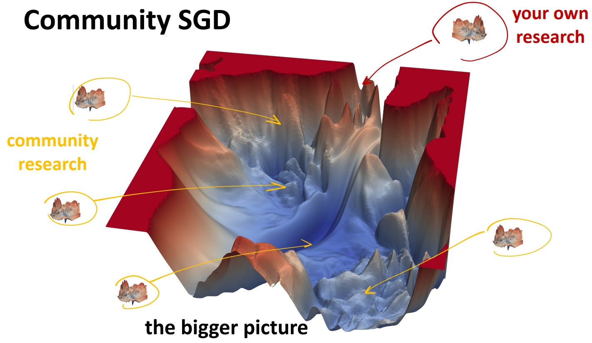

I am a Ph.D. candidate at [The Hong Kong University of Science and Technology](https://hkust.edu.hk/), supervised by [Prof. Xiaomeng LI](https://xmengli.github.io/). I am interested in computer vision, medical image analysis and AI for science.

I obtained BEng from [Northwestern Polytechnical University](https://en.nwpu.edu.cn/), and MPhil from [The Hong Kong Polytechnic University](https://www.polyu.edu.hk/), supervised by [Prof. Yong XIA](https://www.polyu.edu.hk/cee/~ceyxia/).

[Google Scholar](https://scholar.google.com.hk/citations?user=8krbrWsAAAAJ&hl=zh-CN) / [GitHub](https://github.com/duyao-art) / [Twitter](https://twitter.com/yao53513502) / [Email](mailto:ydubf@connect.ust.hk)

News
-----
∙ [2024-11] One paper submitted to [CVPR 2025](https://cvpr.thecvf.com/Conferences/2025) 
∙ [2024-07] One paper accepted to [ECCV 2024](https://eccv.ecva.net) 
∙ [2023-09] One paper accepted to [NeurIPS 2023](https://eccv.ecva.net) 

ML Research
-----

### Teach CLIP to Develop a Number Sense for Ordinal Regression

<strong>Yao Du</strong>, Qiang Zhai, Weihang Dai, Xiaomeng Li† 
European Conference on Computer Vision  (<strong>ECCV</strong>), 2024 
 

### Semi-Supervised Contrastive Learning for Deep Regression with Ordinal Rankings from Spectral Seriation

Weihang Dai, <strong>Yao Du</strong>, Hanru Bai, Kwang-Ting Cheng, Xiaomeng Li† 
International Conference on Neural Information Processing Systems (<strong>NeurIPS</strong>), 2023 
 

AIoT | SmartCity
-----

### Wireless IoT Monitoring System in Hong Kong-Zhuhai-Macao Bridge and Edge Computing for Anomaly Detection

Xiaoyou Wang, Wanglin Wu, <strong>Yao Du</strong>, Jiannong Cao, Qianyi Chen, Yong Xia† 
IEEE Internet of Things Journal, 2023 
 

### Data Anomaly Detection through Semisupervised Learning Aided by Customized Data Augmentation Techniques

<strong>Yao Du*</strong>, Xiaoyou Wang*, Xiaoqing Zhou, Yong Xia† 
Structural Control and Health Monitoring, 2023 
 

### Convolutional Neural Network-based Data Anomaly Detection Considering Class Imbalance with Limited Data

<strong>Yao Du</strong>, Lingfang Li, Rongrong Hou, Xiaoyou Wang, Wei Tian, Yong Xia† 
Smart Structures and Systems, 2022 
 

### Anomaly Detection of Sensor Faults and Extreme Events based on Support Vector Data Description

Yuxuan Zhang, Xiaoyou Wang, Zhenghao Ding, <strong>Yao Du</strong>, Yong Xia† 
Structural Control and Health Monitoring, 2022 
 

### Unsupervised One-class Classification for Condition Assessment of Bridge Cables Using Bayesian Factor Analysis

Xiaoyou Wang, Lingfang Li, Wei Tian, <strong>Yao Du</strong>, Rongrong Hou, Yong Xia† 
Smart Structures and Systems, 2022 
 

Resources Sharing
-----

### ["ML Research, via the Lens of ML", New in ML Workshop, NeurIPS, 2024, Kaiming He.](https://people.csail.mit.edu/kaiming/neurips2024workshop/neurips2024_newinml_kaiming.pdf)

 

 

  
<strong>More Interesting Things in the Near Future</strong>

 
